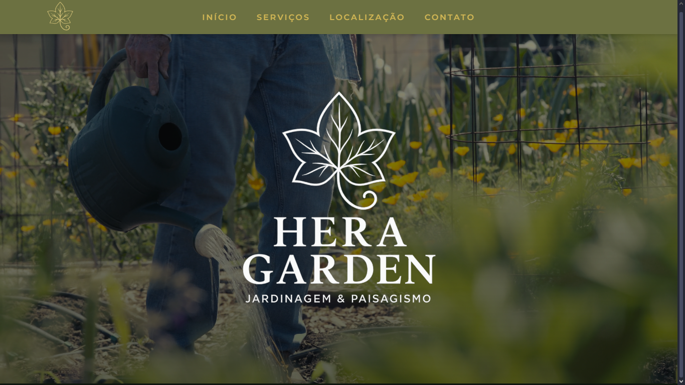

# 🌿 Hera Garden – Jardinagem & Paisagismo  

Site institucional desenvolvido para a empresa **Hera Garden**, especializada em **jardinagem, paisagismo e irrigação**.  
O objetivo do projeto é apresentar os serviços, portfólio e contato da empresa, com foco em um visual elegante, moderno e totalmente responsivo.  

---

## 🪴 Sobre o Projeto  

A **Hera Garden** oferece soluções completas em:  
- 🌼 Jardinagem residencial e corporativa  
- 🌳 Paisagismo e manutenção de áreas verdes  
- 💧 Sistemas de irrigação automatizados  
- 🌱 Consultoria e execução de projetos ambientais  

Este site foi criado para reforçar a identidade visual da marca e facilitar o contato com novos clientes.  

---

## 🧩 Estrutura do Projeto  

hera-garden/
├── index.html
├── iframe-face/
│ └── iframe.html
├── css/
│ └── styles.css
├── js/
│ └── main.js
├── assets/
│ ├── logo.png
│ ├── logo-full.png
│ ├── hero.mp4
│ ├── jardinagem.png
│ ├── paisagismo.png
│ ├── irrigacao.png
│ ├── whatsapp.png
│ └── email.png
└── README.md

---

## 💻 Tecnologias Utilizadas  

- **HTML5** – Estrutura do site  
- **CSS3** – Estilização e responsividade  
- **JavaScript (ES6)** – Interatividade e controle de seções  
- **Fontes Google / Customizadas** – Tipografia moderna  
- **Vídeo background (hero.mp4)** – Apresentação dinâmica na página inicial  

---

## ⚙️ Funcionalidades  

✅ Design moderno e responsivo  
✅ Menu interativo adaptado para dispositivos móveis  
✅ Vídeo institucional incorporado (iframe Facebook)  
✅ Sessões de serviços e contato  
✅ Rodapé com informações da empresa e desenvolvedor  

---

## 🧠 Desenvolvido por  

**Alpphas Technology Solutions**  
💼 Desenvolvimento Web, Infraestrutura & Marketing Digital  

👨‍💻 **Desenvolvedor:** João Antonio Diniz Filho  
📧 [joaoantoniodinizfilho@gmail.com](mailto:joaoantoniodinizfilho@gmail.com)   

---

## 🏢 Informações da Empresa  

**Hera Garden – Jardinagem & Paisagismo**  
CNPJ: 36.120.460/0001-09  
📍 Atendimento em toda a região  
📞 Contato via WhatsApp e e-mail no site  

---

## 🚀 Publicação  

Para publicar o site:  
1. Faça o deploy via **GitHub Pages**, **Vercel**, ou **Netlify**  
2. Envie os arquivos da pasta raiz (index.html, css, js, assets, iframe-face)  
3. Atualize os links de mídia, se necessário  

---

## 📸 Visual  

---

### 💚 “Cuidando da natureza, em cada detalhe do seu espaço verde.”  

## 📸 Prévia

---

👨‍💻 Desenvolvido por [João Antonio Diniz Filho] — Projeto acadêmico / portfólio.
